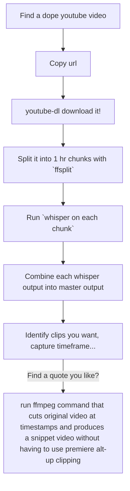

# WIP

## Instructions

### Prerequisites

The following programs should be installed:

- [whisper](https://github.com/openai/whisper)
- [youtube-dl](https://github.com/ytdl-org/youtube-dl)
- [ffmpeg](https://ffmpeg.org/)


## Setup && API (as of 528487c03710b3627ec2219a43cbc5761e594adf)

```
git clone https://github.com/hkievet/yfw.git
cd yfw
npm install
npm install -g ./

yfw start --url <Youtube Video>
yfw startWhisper --file <filePath to mp4>
// check srt transcript file in ./process/output
// determine the indices you want to trim for

yfw trimVideo --video <video name sans extension> --start <start index from srt> --end <end index from srt>
```

## Example

```
yfw start --url https://www.youtube.com/watch\?v\=0EqSXDwTq6U
// rename the video to have .mp4 (dang bug...)
yfw startWhisper --file process/videos/CharliebitmyfingerORIGINAL.mp4
// take a peak at process/output/CharliebitmyfingerORIGINAL.mp4.srt
// START process/output/CharliebitmyfingerORIGINAL.mp4.srt
1
00:00:00,000 --> 00:00:29,000
Ha ha ha, Charlie. Charlie bit me. Ha ha ha, ouch, ouch, ouch, Charlie, ouch,

2
00:00:29,000 --> 00:00:31,000
ouch, ouch, ouch, ouch, ouch,

3
00:00:32,000 --> 00:00:35,000
Charlie, that really hurt.

4
00:00:44,000 --> 00:00:47,000
No, Charlie bit me.

5
00:00:47,000 --> 00:00:55,000
And that really hurt, Charlie, and it's still hurting.
// END process/output/CharliebitmyfingerORIGINAL.mp4.srt

yfw trimVideo --video CharliebitmyfingerORIGINAL --start 3 --end 3
// see process/trimmed/Charlie,hurt.CharliebitmyfingerORIGINAL.mp4
// Contains the video clip where the poor kid says "Charlie, that really hurt".
```

1. Need a cmd line interface to call with a youtube url that will download the url to videos.


Use commander...

## Vision


