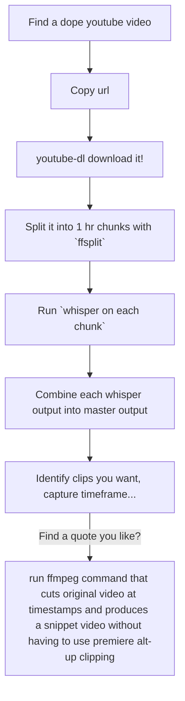

# WIP

1. Need a cmd line interface to call with a youtube url that will download the url to videos.

Use commander...

## Vision

```mermaid
graph TD;
    A[Find a dope youtube video]-->B[Copy url];
    B-->C[youtube-dl download it!]-->D[Split it into 1 hr chunks with `ffsplit`];
    D-->E[Run `whisper on each chunk`]
    E-->F[Combine each whisper output into master output]
    F-->G[Identify clips you want, capture timeframe...]
    G-->|Find a quote you like?|H[run ffmpeg command that cuts original video at timestamps and produces a snippet video without having to use premiere alt-up clipping]
```
